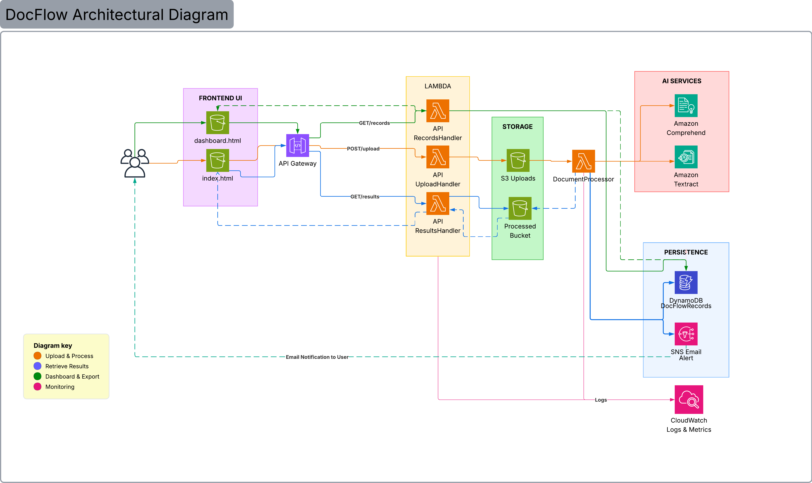

# 🤖 DocFlow — Intelligent Document Processing Pipeline

AI-powered document extraction and analysis system built on AWS serverless architecture. Drop in an invoice or receipt, get back structured data in under 30 seconds.

[](https://aws.amazon.com/)
[](https://www.python.org/)
[]()
[]()

> **Project Status:** ✅ Complete — All 9 Phases  
> **Total Cost:** $5.90 / $25.00 Budget  
> **Timeline:** January 16 – March 21, 2026  
> **Live Demo:** [DocFlow Pipeline](https://doc-processing-demo-frontend-848747536965.s3-website-us-east-1.amazonaws.com)

---

## 📋 Table of Contents

- [Overview](#overview)
- [Architecture](#architecture)
- [Key Features](#key-features)
- [Technology Stack](#technology-stack)
- [Results](#results)
- [Cost Analysis](#cost-analysis)
- [Project Structure](#project-structure)
- [Getting Started](#getting-started)
- [Development Progress](#development-progress)
- [Key Learnings](#key-learnings)
- [Future Enhancements](#future-enhancements)
- [Contact](#contact)

---

## 🎯 Overview

### The Problem
Manual document processing takes 3 minutes per document and costs $1.25 in staff time — tedious, error-prone, and doesn't scale.

### The Solution
A fully serverless AWS pipeline that:
- ⚡ Processes documents in **30 seconds**
- 💵 Costs **$0.034 per document**
- 🎯 Achieved **100% success rate** on 150-document batch test
- 📊 Extracts text, key-value pairs, entities, and sentiment automatically

---

## 🏗️ Architecture

```


```

### Data Flow
1. **Upload** → User drops document into web UI
2. **Store** → File saved to S3 uploads bucket via API Gateway
3. **Trigger** → S3 event fires document-processor Lambda
4. **Extract** → Textract pulls text, forms, tables
5. **Analyze** → Comprehend detects entities, sentiment, key phrases
6. **Save** → Structured JSON written to processed bucket
7. **Retrieve** → Frontend polls results via GET /results
8. **Display** → Results rendered in pipeline visualization UI

---

## ✨ Key Features

**Core Pipeline**
- 📄 PDF document processing with PyPDF2 preprocessing layer
- 🔍 OCR text extraction via AWS Textract
- 📊 Key-value pair extraction (invoice numbers, totals, dates)
- 🏷️ Entity recognition (organizations, locations, dates, amounts)
- 😐 Sentiment analysis on document content
- 💡 Key phrase extraction

**Infrastructure**
- ☁️ Fully serverless — no servers to manage
- 🔄 Event-driven processing via S3 triggers
- 🔒 Rate limiting: 5 req/s, burst 10, 100 req/day (FinOps guardrail)
- 🏷️ Comprehensive resource tagging with automated weekly compliance audits
- 📈 Auto-scaling under variable load

**FinOps**
- Rate limiting implemented before going live (prevents runaway costs)
- CONFIG.SIMULATE flag for safe frontend development without hitting real APIs
- Weekly tag audit Lambda (EventBridge + SNS) for cost allocation governance
- True project cost: $5.90 — $3.55 of which came from a single 150-doc batch test

---

## 🛠️ Technology Stack

| Category | Services / Tools |
|----------|-----------------|
| Compute | AWS Lambda (Python 3.11) |
| Storage | AWS S3 (3 buckets: uploads, processed, frontend) |
| AI/ML | AWS Textract, AWS Comprehend |
| API | AWS API Gateway (REST, REGIONAL) |
| Monitoring | AWS CloudWatch, AWS CloudTrail |
| Automation | AWS EventBridge, AWS SNS |
| Security | AWS IAM |
| Frontend | HTML5, CSS3, JavaScript ES6+ |
| Tooling | AWS CLI, Python, Bash, Git |

---

## 📊 Results

| Metric | Result |
|--------|--------|
| Documents tested | 150 |
| Success rate | 100% |
| Avg extraction confidence | 80.88% |
| Avg processing time | <30 seconds |
| Cost per document | $0.034 |
| vs. manual processing | 97% cheaper |
| Total project cost | $5.90 |

> **Confidence note:** 80.88% average reflects complex PDFs pulling the score down. Simple/medium documents consistently hit 94%+. Deep incompatibilities with complex PDFs are documented with a remediation path (pdf2image + poppler) in Phase 4.

---

## 💰 Cost Analysis

### Development Cost (Actual)

| Phase | Activity | Cost |
|-------|----------|------|
| 1–6 | S3, Lambda, API Gateway, testing | ~$0.52 |
| 7 | 150-document batch test (Textract AnalyzeDocTables) | $3.55 |
| 8 | Optimization smoke test | $0.00 |
| **Total** | | **$4.07** |

> The $3.55 Textract overage came from hitting the 100-page/month free tier limit for AnalyzeDocTables in a single batch test. Rate limiting (100 req/day cap) prevents this in ongoing use.

### Production Cost Model (500 docs/month)

| Service | Monthly Cost |
|---------|-------------|
| S3 Storage | $1.15 |
| S3 Requests | $0.01 |
| Lambda | $1.25 |
| Textract | $1.50 |
| Comprehend | $10.00 |
| API Gateway | $0.01 |
| CloudWatch | $2.00 |
| Data Transfer | $0.90 |
| **Total** | **~$17/month** |

**Annual production cost:** ~$204  
**vs. manual processing (500 docs/month):** $625/month  
**Annual savings:** $6,036 (80% reduction)  
**ROI:** 3,558%

---

## 📁 Project Structure

```
IDR_pipeline/
├── config/
│   ├── setup.sh                    ← Environment variables + tagging config
│   └── resource-tags.json          ← Standard tag definitions
├── docs/
│   ├── screenshots/                ← Phase-by-phase screenshots
│   ├── Architecture_DataFlow_Documentation.md
│   ├── Architecture_Diagram_Visual.html
│   ├── AWS_Project_Cost_Tracker.xlsx
│   ├── Doc_Processing_Development_Log.md
│   ├── Document_Processing_Implementation_Guide.md
│   └── TAGGING_STRATEGY.md
├── lambda/
│   ├── api-upload-handler/         ← POST /upload handler
│   ├── api-results-handler/        ← GET /results handler
│   ├── document-processor/         ← Core Textract + Comprehend pipeline
│   ├── layers/                     ← PyPDF2 Lambda layer
│   └── tag-audit/                  ← Weekly tag compliance function
├── policies/
│   ├── bucket-policy-uploads.json
│   ├── lambda-audit-trust-policy.json
│   ├── lifecycle-policy.json
│   ├── s3-notification.json
│   └── tag-audit-policy.json
├── scripts/
│   ├── batch_test.py               ← 150-document batch test runner
│   ├── check-results.py
│   ├── fix-tags.sh                 ← Apply standard tags to any resource ARN
│   ├── generate-test-documents.py
│   ├── monitor-lambda.sh
│   ├── select-test-documents.py
│   ├── upload-document.sh
│   ├── verify-phase1.sh
│   └── verify-tag-audit.sh
├── src/
│   └── frontend/
│       ├── index.html              ← Upload UI + pipeline visualization
│       ├── styles.css
│       └── app.js                  ← CONFIG.SIMULATE flag, API integration
├── test-results/
│   ├── phase3-results/             ← 15-document Textract testing results
│   └── test-results-phase7.json   ← 150-document batch test output
├── .env
├── .gitignore
└── README.md
```

---

## 🚀 Getting Started

### Prerequisites
- AWS account with free tier active
- AWS CLI configured
- Python 3.11
- Git Bash (Windows) or Terminal (Mac/Linux)

### Setup

```bash
# Clone the repo
git clone https://github.com/theDovelyDev/theprojectfolder.git
cd theprojectfolder/IDR_pipeline

# Copy and configure environment
cp config/setup.sh.example config/setup.sh
# Edit setup.sh with your AWS account ID and preferences

# Load environment
source config/setup.sh
```

### Deploy

Follow the [Implementation Guide](docs/Document_Processing_Implementation_Guide.md) for full phase-by-phase deployment instructions.

---

## 📈 Development Progress

| Phase | Description | Status |
|-------|-------------|--------|
| Phase 1 | S3 Setup + Tag Governance | ✅ Complete |
| Phase 2 | Lambda + Document Processor | ✅ Complete |
| Phase 3 | Textract Integration + Testing | ✅ Complete |
| Phase 4 | PDF Preprocessing + Lambda Optimization | ✅ Complete |
| Phase 5 | Frontend Development | ✅ Complete |
| Phase 6 | API Gateway Integration | ✅ Complete |
| Phase 7 | End-to-End Testing (150 docs) | ✅ Complete |
| Phase 8 | Optimization & Cost Reduction | ✅ Complete |
| Phase 9 | Documentation & Portfolio Prep | ✅ Complete |

---

## 💡 Key Learnings

**Engineering**
- Preprocessing has limits — PyPDF2 normalization improved Textract compatibility but couldn't fix deep encoding incompatibilities in complex PDFs. Ship with documented limitations and a remediation path.
- Rate limiting is a FinOps concern, not just a security one — implement it before going live, not after.
- `CONFIG.SIMULATE` flags let you build and demo frontends without burning API budget.

**AWS-Specific**
- CORS must be configured in two places for Lambda proxy integration: API Gateway AND Lambda response headers.
- Lambda zip packaging requires explicit file targeting — `shutil.make_archive()` will pick up everything in the directory including nested zips.
- CloudWatch log group names cause path conversion errors in Git Bash on Windows — use `MSYS_NO_PATHCONV=1`.

**FinOps**
- The $3.55 Textract overage from batch testing revealed that rate limiting protects against per-second abuse but not monthly free tier consumption — two different problems, two different solutions.
- Build-and-test at scale is what surfaces real cost behavior. That's the point.

---

## 🚀 Future Enhancements

- [ ] OCR fallback pipeline: pdf2image + poppler for complex PDFs (remediation for 20% failure case)
- [ ] SQS queue for batch processing at scale
- [ ] Cognito authentication for multi-user access
- [ ] Admin dashboard with CloudWatch metrics embedded
- [ ] Document classification (invoice vs. receipt vs. contract)
- [ ] Support for handwritten documents via Textract custom models
- [ ] Multi-language support via Comprehend

---

## 📬 Contact & Links

- **GitHub:** [theDovelyDev](https://github.com/theDovelyDev)
- **LinkedIn:** [Carlandra Williams](https://linkedin.com/in/carlandra-williams)
- **Portfolio:** [theprojectfolder.com](https://theprojectfolder.com)
- **Substack:** [Carlandra in the Cloud](https://carlandrainthecloud.substack.com)

---

*Built with ☁️ AWS, 🐍 Python, and the honest acknowledgment that $3.55 of the $6.90 total came from proving it actually works at scale.*

*Last Updated: March 23, 2026*